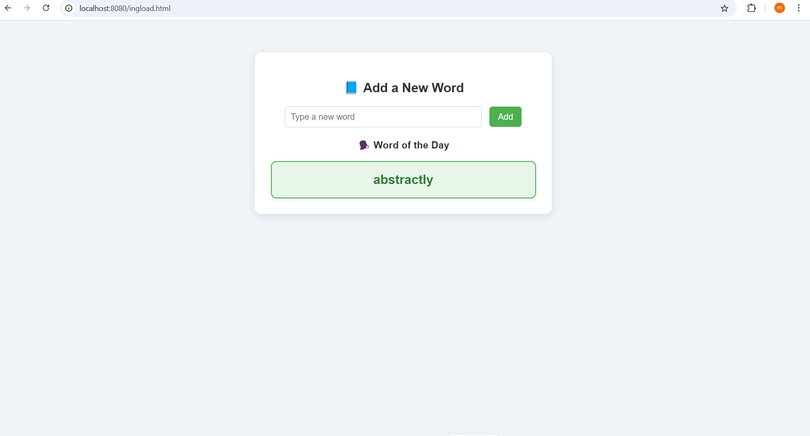

# English Vocabulary Reminder App

This is a simple web-based application I built to help myself memorize English words while reading books. The idea is to note down unknown words, store them in a local database, and get reminded of them periodically to improve retention and long-term memory.

## 🎬 Demo Video

## 🎯 Purpose

While reading English books, I often come across unfamiliar words. This tool helps me:
- Save those words quickly
- Review them regularly
- Track my vocabulary progress over time

## 🚀 Features 

- Add and store new English words
- Set custom reminders for word revision
- Display saved words in a table format
- Simple and user-friendly interface
- Local database support (can be extended to remote DB)

## 🛠️ Technologies Used

- HTML, CSS, JavaScript
- LocalStorage / Web SQL (or your preferred DB logic)
- Bootstrap (optional UI styling)
- Future-ready for backend integration (e.g., Spring Boot, Node.js)

## 📈 Personal Value

I built this for my own learning, but also as a way to improve my skills as a developer. It shows:
- My understanding of front-end development
- My ability to solve real-life problems with code
- Interest in both language learning and software engineering

## 📂 How to Use

1. Open `ingload.html` in your browser.
2. Enter a word and its meaning.
3. Click save – the word is stored.
4. Use the reminder feature to revisit saved words daily/weekly.

## ✨ Future Improvements

- User login & cloud-based storage
- Audio pronunciation feature
- Word usage examples
- Spaced repetition algorithm

## 👨‍💻 Developed by

A self-taught developer and English learner.  
This project reflects both my language journey and my growth in software development.

